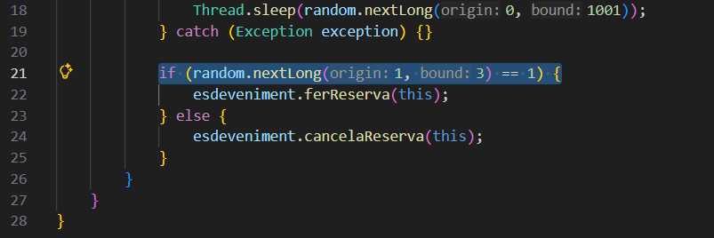
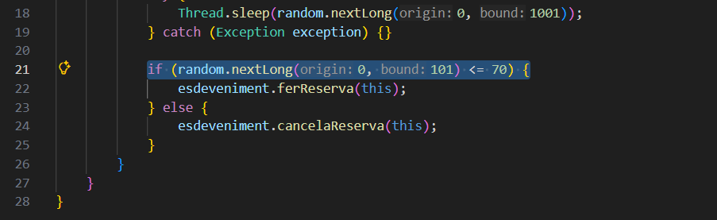
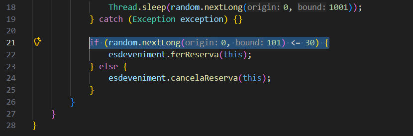

1. Per què s'atura l'execució al cap d'un temps?
Perque tothom vol reservar pero no hi han places aixi que comença una espera infinita per tots els assistents.

2. Què passaria si en lloc de una probabilitat de 50%-50% fora de 70% (ferReserva) -30% (cancel·lar)? I si foren al revés les probabilitats? → Mostra la porció de codi modificada i la sortida resultant en cada un dels 2 casos
En cas de 70% reserva 30% cancelació arribariem més rapid a l'espera infinita per el que he explicat
En cas de 30% reserva 70% cancelació arribariem més lent a l'espera infinita

70% reserva 30% cancelació:
Codi Modificat:

Sortida:
Assistent-9 no ha pogut cancel·lar una reserva inexistent. Places disponibles: 5
Assistent-8 no ha pogut cancel·lar una reserva inexistent. Places disponibles: 5
Assistent-2 ha fet una reserva. Places disponibles: 4
Assistent-3 ha fet una reserva. Places disponibles: 3
Assistent-8 ha fet una reserva. Places disponibles: 2
Assistent-0 ha fet una reserva. Places disponibles: 1
Assistent-0 ha fet una reserva. Places disponibles: 0
Assistent-7 no ha pogut cancel·lar una reserva inexistent. Places disponibles: 0
Assistent-3 ha cancel·lat una reserva. Places disponibles: 1
Assistent-8 ha fet una reserva. Places disponibles: 0
Assistent-0 ha cancel·lat una reserva. Places disponibles: 1
Assistent-9 ha fet una reserva. Places disponibles: 0
Assistent-9 ha cancel·lat una reserva. Places disponibles: 1
Assistent-4 ha fet una reserva. Places disponibles: 0
Assistent-4 ha cancel·lat una reserva. Places disponibles: 1
Assistent-6 ha fet una reserva. Places disponibles: 0
Assistent-1 no ha pogut cancel·lar una reserva inexistent. Places disponibles: 0
Assistent-2 ha cancel·lat una reserva. Places disponibles: 1
Assistent-3 ha fet una reserva. Places disponibles: 0
Assistent-7 no ha pogut cancel·lar una reserva inexistent. Places disponibles: 0

30% reserva 70% cancelació:
Codi Modificat:

Sortida:
Assistent-4 no ha pogut cancel·lar una reserva inexistent. Places disponibles: 5
Assistent-9 ha fet una reserva. Places disponibles: 4
Assistent-3 no ha pogut cancel·lar una reserva inexistent. Places disponibles: 4
Assistent-1 no ha pogut cancel·lar una reserva inexistent. Places disponibles: 4
Assistent-0 no ha pogut cancel·lar una reserva inexistent. Places disponibles: 4
Assistent-2 no ha pogut cancel·lar una reserva inexistent. Places disponibles: 4
Assistent-7 no ha pogut cancel·lar una reserva inexistent. Places disponibles: 4
Assistent-8 no ha pogut cancel·lar una reserva inexistent. Places disponibles: 4
Assistent-3 no ha pogut cancel·lar una reserva inexistent. Places disponibles: 4
Assistent-5 no ha pogut cancel·lar una reserva inexistent. Places disponibles: 4
Assistent-8 ha fet una reserva. Places disponibles: 3
Assistent-3 no ha pogut cancel·lar una reserva inexistent. Places disponibles: 3
Assistent-4 no ha pogut cancel·lar una reserva inexistent. Places disponibles: 3
Assistent-9 ha cancel·lat una reserva. Places disponibles: 4
Assistent-6 no ha pogut cancel·lar una reserva inexistent. Places disponibles: 4
Assistent-8 ha cancel·lat una reserva. Places disponibles: 5
Assistent-0 no ha pogut cancel·lar una reserva inexistent. Places disponibles: 5
Assistent-1 no ha pogut cancel·lar una reserva inexistent. Places disponibles: 5
Assistent-6 no ha pogut cancel·lar una reserva inexistent. Places disponibles: 5
Assistent-5 no ha pogut cancel·lar una reserva inexistent. Places disponibles: 5
Assistent-0 ha fet una reserva. Places disponibles: 4
Assistent-7 no ha pogut cancel·lar una reserva inexistent. Places disponibles: 4
Assistent-2 no ha pogut cancel·lar una reserva inexistent. Places disponibles: 4
Assistent-6 no ha pogut cancel·lar una reserva inexistent. Places disponibles: 4
Assistent-4 no ha pogut cancel·lar una reserva inexistent. Places disponibles: 4
Assistent-1 no ha pogut cancel·lar una reserva inexistent. Places disponibles: 4
Assistent-7 no ha pogut cancel·lar una reserva inexistent. Places disponibles: 4
Assistent-4 no ha pogut cancel·lar una reserva inexistent. Places disponibles: 4
Assistent-6 no ha pogut cancel·lar una reserva inexistent. Places disponibles: 4
Assistent-3 ha fet una reserva. Places disponibles: 3
Assistent-8 no ha pogut cancel·lar una reserva inexistent. Places disponibles: 3
Assistent-9 ha fet una reserva. Places disponibles: 2
Assistent-8 ha fet una reserva. Places disponibles: 1
Assistent-0 ha cancel·lat una reserva. Places disponibles: 2
Assistent-4 no ha pogut cancel·lar una reserva inexistent. Places disponibles: 2
Assistent-2 ha fet una reserva. Places disponibles: 1
Assistent-6 no ha pogut cancel·lar una reserva inexistent. Places disponibles: 1
Assistent-7 no ha pogut cancel·lar una reserva inexistent. Places disponibles: 1
Assistent-1 ha fet una reserva. Places disponibles: 0
Assistent-5 no ha pogut cancel·lar una reserva inexistent. Places disponibles: 0
Assistent-4 no ha pogut cancel·lar una reserva inexistent. Places disponibles: 0
Assistent-1 ha cancel·lat una reserva. Places disponibles: 1
Assistent-8 ha cancel·lat una reserva. Places disponibles: 2
Assistent-9 ha cancel·lat una reserva. Places disponibles: 3
Assistent-6 no ha pogut cancel·lar una reserva inexistent. Places disponibles: 3
Assistent-7 no ha pogut cancel·lar una reserva inexistent. Places disponibles: 3
Assistent-2 ha cancel·lat una reserva. Places disponibles: 4
Assistent-3 ha cancel·lat una reserva. Places disponibles: 5
Assistent-5 ha fet una reserva. Places disponibles: 4
Assistent-4 no ha pogut cancel·lar una reserva inexistent. Places disponibles: 4
Assistent-7 no ha pogut cancel·lar una reserva inexistent. Places disponibles: 4
Assistent-9 no ha pogut cancel·lar una reserva inexistent. Places disponibles: 4
Assistent-0 no ha pogut cancel·lar una reserva inexistent. Places disponibles: 4
Assistent-2 no ha pogut cancel·lar una reserva inexistent. Places disponibles: 4
Assistent-7 ha fet una reserva. Places disponibles: 3
Assistent-9 no ha pogut cancel·lar una reserva inexistent. Places disponibles: 3
Assistent-1 no ha pogut cancel·lar una reserva inexistent. Places disponibles: 3
Assistent-6 no ha pogut cancel·lar una reserva inexistent. Places disponibles: 3
Assistent-5 ha fet una reserva. Places disponibles: 2
Assistent-0 no ha pogut cancel·lar una reserva inexistent. Places disponibles: 2
Assistent-3 no ha pogut cancel·lar una reserva inexistent. Places disponibles: 2
Assistent-8 ha fet una reserva. Places disponibles: 1
Assistent-2 no ha pogut cancel·lar una reserva inexistent. Places disponibles: 1
Assistent-8 ha cancel·lat una reserva. Places disponibles: 2
Assistent-8 ha fet una reserva. Places disponibles: 1
Assistent-1 no ha pogut cancel·lar una reserva inexistent. Places disponibles: 1
Assistent-3 no ha pogut cancel·lar una reserva inexistent. Places disponibles: 1
Assistent-4 no ha pogut cancel·lar una reserva inexistent. Places disponibles: 1
Assistent-7 ha cancel·lat una reserva. Places disponibles: 2
Assistent-0 no ha pogut cancel·lar una reserva inexistent. Places disponibles: 2
Assistent-5 ha fet una reserva. Places disponibles: 1
Assistent-9 no ha pogut cancel·lar una reserva inexistent. Places disponibles: 1
Assistent-6 no ha pogut cancel·lar una reserva inexistent. Places disponibles: 1
Assistent-8 ha fet una reserva. Places disponibles: 0
Assistent-3 no ha pogut cancel·lar una reserva inexistent. Places disponibles: 0
Assistent-9 no ha pogut cancel·lar una reserva inexistent. Places disponibles: 0
Assistent-9 no ha pogut cancel·lar una reserva inexistent. Places disponibles: 0
Assistent-3 no ha pogut cancel·lar una reserva inexistent. Places disponibles: 0
Assistent-4 no ha pogut cancel·lar una reserva inexistent. Places disponibles: 0
Assistent-2 no ha pogut cancel·lar una reserva inexistent. Places disponibles: 0
Assistent-2 no ha pogut cancel·lar una reserva inexistent. Places disponibles: 0
Assistent-6 no ha pogut cancel·lar una reserva inexistent. Places disponibles: 0
Assistent-8 ha cancel·lat una reserva. Places disponibles: 1
Assistent-5 ha fet una reserva. Places disponibles: 0
Assistent-0 no ha pogut cancel·lar una reserva inexistent. Places disponibles: 0
Assistent-2 no ha pogut cancel·lar una reserva inexistent. Places disponibles: 0
Assistent-5 ha cancel·lat una reserva. Places disponibles: 1
Assistent-1 ha fet una reserva. Places disponibles: 0
Assistent-9 no ha pogut cancel·lar una reserva inexistent. Places disponibles: 0
Assistent-3 no ha pogut cancel·lar una reserva inexistent. Places disponibles: 0
Assistent-8 ha cancel·lat una reserva. Places disponibles: 1
Assistent-2 ha fet una reserva. Places disponibles: 0
Assistent-9 no ha pogut cancel·lar una reserva inexistent. Places disponibles: 0
Assistent-9 no ha pogut cancel·lar una reserva inexistent. Places disponibles: 0
Assistent-0 no ha pogut cancel·lar una reserva inexistent. Places disponibles: 0
Assistent-9 no ha pogut cancel·lar una reserva inexistent. Places disponibles: 0
Assistent-3 no ha pogut cancel·lar una reserva inexistent. Places disponibles: 0
Assistent-3 no ha pogut cancel·lar una reserva inexistent. Places disponibles: 0
Assistent-2 ha cancel·lat una reserva. Places disponibles: 1
Assistent-1 ha fet una reserva. Places disponibles: 0
Assistent-8 no ha pogut cancel·lar una reserva inexistent. Places disponibles: 0
Assistent-8 no ha pogut cancel·lar una reserva inexistent. Places disponibles: 0
Assistent-2 no ha pogut cancel·lar una reserva inexistent. Places disponibles: 0
Assistent-1 ha cancel·lat una reserva. Places disponibles: 1
Assistent-4 ha fet una reserva. Places disponibles: 0
Assistent-3 no ha pogut cancel·lar una reserva inexistent. Places disponibles: 0
Assistent-9 no ha pogut cancel·lar una reserva inexistent. Places disponibles: 0
Assistent-3 no ha pogut cancel·lar una reserva inexistent. Places disponibles: 0
Assistent-1 ha cancel·lat una reserva. Places disponibles: 1
Assistent-7 ha fet una reserva. Places disponibles: 0
Assistent-4 ha cancel·lat una reserva. Places disponibles: 1
Assistent-6 ha fet una reserva. Places disponibles: 0
Assistent-1 no ha pogut cancel·lar una reserva inexistent. Places disponibles: 0
Assistent-8 no ha pogut cancel·lar una reserva inexistent. Places disponibles: 0
Assistent-1 no ha pogut cancel·lar una reserva inexistent. Places disponibles: 0
Assistent-1 no ha pogut cancel·lar una reserva inexistent. Places disponibles: 0
Assistent-8 no ha pogut cancel·lar una reserva inexistent. Places disponibles: 0
Assistent-8 no ha pogut cancel·lar una reserva inexistent. Places disponibles: 0
Assistent-7 ha cancel·lat una reserva. Places disponibles: 1
Assistent-2 ha fet una reserva. Places disponibles: 0
Assistent-6 ha cancel·lat una reserva. Places disponibles: 1
Assistent-0 ha fet una reserva. Places disponibles: 0
Assistent-1 no ha pogut cancel·lar una reserva inexistent. Places disponibles: 0
Assistent-7 no ha pogut cancel·lar una reserva inexistent. Places disponibles: 0
Assistent-6 no ha pogut cancel·lar una reserva inexistent. Places disponibles: 0
Assistent-8 no ha pogut cancel·lar una reserva inexistent. Places disponibles: 0
Assistent-7 no ha pogut cancel·lar una reserva inexistent. Places disponibles: 0
Assistent-8 no ha pogut cancel·lar una reserva inexistent. Places disponibles: 0
Assistent-1 no ha pogut cancel·lar una reserva inexistent. Places disponibles: 0
Assistent-6 no ha pogut cancel·lar una reserva inexistent. Places disponibles: 0
Assistent-8 no ha pogut cancel·lar una reserva inexistent. Places disponibles: 0
Assistent-8 no ha pogut cancel·lar una reserva inexistent. Places disponibles: 0

3. Perquè creus que fa falta la llista i no valdria només amb una variable sencera de reserves?
Per determinar si l'assistent realment ha fet una reserva o no per determinar si es una cancelació valida o falsa